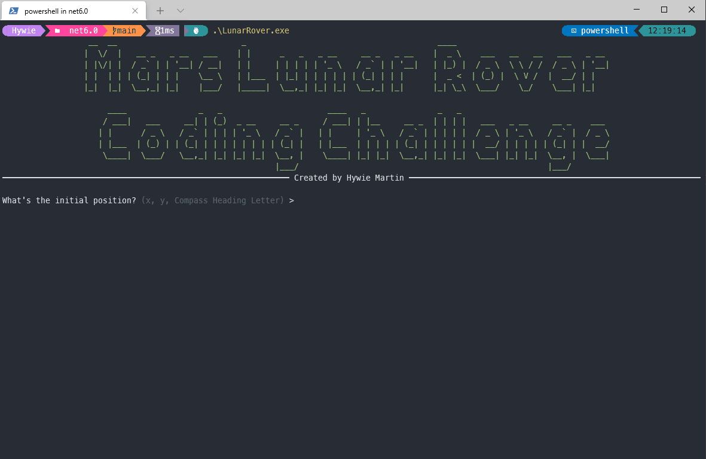

<!-- PROJECT LOGO -->
 

  
  <h3 align="center">Mars Lunar Rover Coding Challenge</h3>

  

    A coding challenge completed by Hywie Martin
     
    <a href="https://github.com/Hywie/lunar-rover/blob/bece3cee01b371ee82f844259e369dd8981d7e99/LunarRover/LunarRover/Program.cs"><strong>Explore the Code »</strong></a>
    
  

<!-- ABOUT THE PROJECT -->

---

## About The Challenge

    

You have been assigned to the prestigious Mars Rover Prototype project and have been tasked with creating a basic control system for the rover.

The rover is sitting in a conveniently square crater that has been divided into a 5 by 5 grid.
The position of the rover can be described by its X and Y coordinates within the grid and the direction that it is facing in the form of the compass points N, E, S or W.

For example, a position of 0, 0, E means the rover is in the bottom left corner of the grid and is facing East.

A position of 3, 4, S means the rover is in the 4th square along and the 5th (or top) square up and is facing South
The rover is controlled by sending it a sequence of instructions. Each instruction will either be:
‘L’ to make the rover spin 90 degrees to the left
‘R’ to make it spin 90 degrees to the right
‘F’ to make it move forward one grid square in the direction that it is facing

If the instruction causes the rover to attempt to move out of the grid, then it will collide with the crater wall and scuff its shiny new paintwork. If this happens the rover must return to its position before that instruction. Please count the number of scuffs picked up during the entire sequence of instructions.

The rover must be able to receive an initial location and direction and then follow a sequence of instructions, reporting its location and direction after each instruction has been processed.

Your task is to implement the logic to control the rover.

---

## Built With

> Built in C# on .NET 6.0 with the help of [spectre console library](https://github.com/spectreconsole/spectre.console) for the CLI interface. For the sake of time, no tests have been written for the cli input or output text.

 

The application has a [vehicle invoker](https://github.com/Hywie/lunar-rover/blob/bece3cee01b371ee82f844259e369dd8981d7e99/LunarRover/LunarRover/Invokers/VehicleInvoker.cs) that has the ability to store and execute instructions which action on any vehicle. This invoker has the ability to run any [command](https://github.com/Hywie/lunar-rover/blob/bece3cee01b371ee82f844259e369dd8981d7e99/LunarRover/LunarRover/Commands/ICommand.cs), in any order, on any type of [vehicle](https://github.com/Hywie/lunar-rover/blob/bece3cee01b371ee82f844259e369dd8981d7e99/LunarRover/LunarRover/Vehicles/IVehicle.cs) which can be on any kind of [terrain](https://github.com/Hywie/lunar-rover/blob/bece3cee01b371ee82f844259e369dd8981d7e99/LunarRover/LunarRover/Terrain/ITerrain.cs).

As this challenge has a time limit, only a [rover vehicle](https://github.com/Hywie/lunar-rover/blob/bece3cee01b371ee82f844259e369dd8981d7e99/LunarRover/LunarRover/Vehicles/RoverVehicle.cs), [crater terrain](https://github.com/Hywie/lunar-rover/blob/bece3cee01b371ee82f844259e369dd8981d7e99/LunarRover/LunarRover/Terrain/Crater.cs) and [commands for the rover](https://github.com/Hywie/lunar-rover/tree/main/LunarRover/LunarRover/Commands) have been implemented. This could be expanded so we can also have a different terrain that behaves differently or a different vehicle. For example, we could create a UFO that has move commands that behave differently on different terrains.

---

<!-- USAGE EXAMPLES -->

## Usage

> Check out the [integration test](https://github.com/Hywie/lunar-rover/blob/bece3cee01b371ee82f844259e369dd8981d7e99/LunarRover/LunarRoverTests/IntegrationTests/LunarRoverScenario.cs) to see how to use the invoker in the code.

1. Enter the start position and compass direction of the rover when asked. E.G. `1,2,N`.
2. Enter a line of commands. `F` to move forward, `L` to rotate left, `R` to rotate right. E.G. `FFLRFF`.
3. View the output of moves the rover has made along with the final status.
